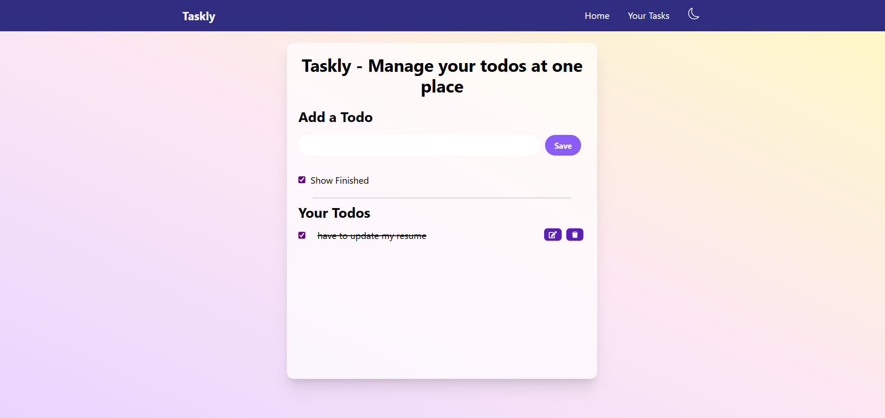
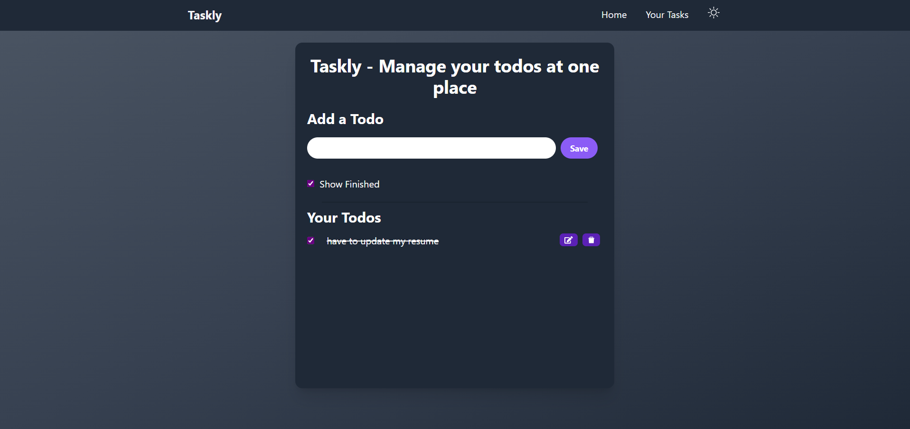

# 📝 Taskly - Todo List App

**Taskly** is a modern and minimalistic Todo List App built with **React** and **Tailwind CSS**, allowing users to manage their daily tasks easily. It supports features like task creation, deletion, editing, completion status, and a light/dark mode toggle for better user experience.

---

## 🔧 Features

- ✅ Add new tasks
- 🖊️ Edit existing tasks
- ❌ Delete tasks
- ✅ Mark tasks as completed
- 👁️ Toggle visibility of completed tasks
- 🌙 Dark mode toggle
- 💾 Tasks saved in `localStorage`

---

## 📸 Preview

---

## 🛠️ Tech Stack

- **React** (Functional Components & Hooks)
- **Tailwind CSS** for styling
- **React Icons** for UI icons
- **UUID** for unique task IDs
- **LocalStorage** for task persistence

